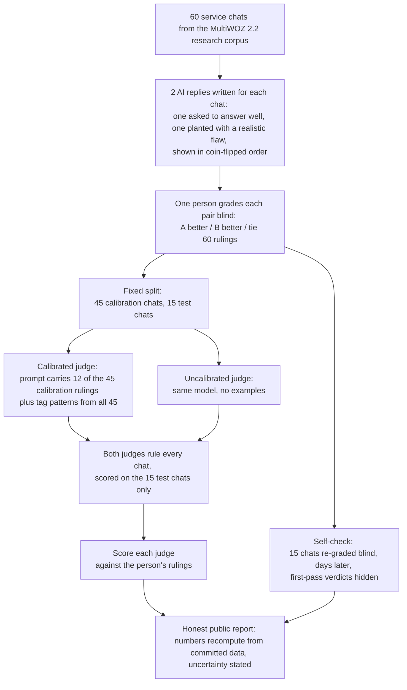
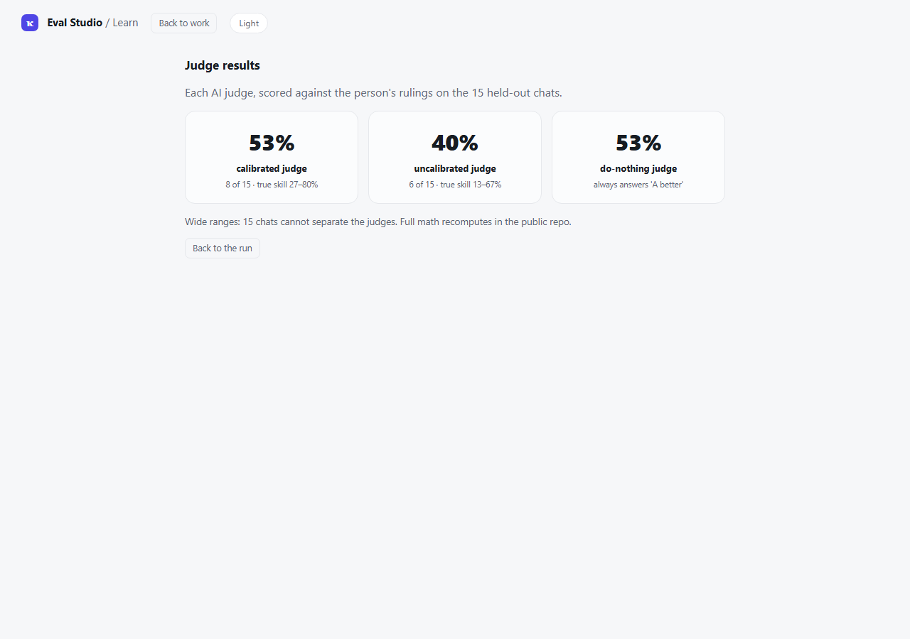

# Business Scenario Judge

## Can you trust an AI to grade another AI? This repo checks.

- **What this is:** one person blind-graded 60 real service chats from a public research corpus in a labeling tool built for the job. Two AI judges were then scored against those rulings on 15 chats kept aside as the test: one calibrated (shown the person's example rulings first), one uncalibrated (shown none).
- **The idea:** an AI judge is only a trustworthy stand-in for a human after you measure how well it matches that human.
- **The unflattering result ships anyway:** a do-nothing judge that always gives the same answer matched the human as often as the calibrated one. Both land on 53%, and 15 test chats cannot tell the judges apart. That finding paid for the lessons: [What this taught](#what-this-taught).

[](https://github.com/Mike-E-Log/business-scenario-judge/actions/workflows/tests.yml)
[](https://github.com/Mike-E-Log/business-scenario-judge/actions/workflows/leak-scan.yml)
[](LICENSE)
[](#running-it-yourself)

<p align="center">
  <sub>Built by <a href="https://github.com/Mike-E-Log"><b>Mike Ilog</b></a> · AI Engineer · LLM &amp; agent evaluation &nbsp;·&nbsp; <a href="https://www.linkedin.com/in/mikeilog/">LinkedIn</a></sub>
  <br>
  <sub>Built with AI assistance (Claude); the 60 blind rulings, their reason tags, and the 2 to 4 day blind retest are entirely my own.</sub>
</p>

## Contents

- [What this taught](#what-this-taught)
- [The whole eval, in one diagram](#the-whole-eval-in-one-diagram)
- [The problem](#the-problem)
- [What this is, exactly](#what-this-is-exactly)
- [Experiment 1: the self-check (grading twice)](#experiment-1-the-self-check-grading-twice)
- [Experiment 2: the judge calibration](#experiment-2-the-judge-calibration)
  - [The honest result](#the-honest-result)
- [Built with Eval Studio](#built-with-eval-studio)
- [Limitations](#limitations)
- [Running it yourself](#running-it-yourself)
- [Repository layout](#repository-layout)
- [License](#license)

## What this taught

This project taught me five things I will use in every eval after it:

- **An AI judge needs more examples than you expect.** I taught this judge with 45 rulings. The practitioner floor is 100 or more, kept fresh over time ([Hamel Husain's evals FAQ](https://hamel.dev/blog/posts/evals-faq/)). Under that floor, wide error ranges are the expected result. That is what I got.
- **A small test cannot pick a winner.** With only 15 test chats, luck moves the scores, and one changed ruling flips the story ([The honest result](#the-honest-result)). Before trusting any judge score, ask how big the test was.
- **Check the grader before the judge.** Days later, I re-graded 15 chats blind. I matched my own rulings on just 12 of them ([Experiment 1](#experiment-1-the-self-check-grading-twice)). A judge cannot agree with me more than I agree with myself. So measure the grader first.
- **Planted flaws are not real failures.** I planted one flaw in each pair to create the answers fast. My blind rulings did not track them ([Limitations](#limitations)): what I actually flagged was clarity, missed instructions, and missing pieces ([the reason tags](metrics/results.md)). Labels should come from real failures, found by reading real outputs ([same FAQ](https://hamel.dev/blog/posts/evals-faq/)).
- **Define the success criteria before you see the score.** I wrote them down before the judges ran, in a plan that cannot change afterward ([PREREGISTRATION.md](PREREGISTRATION.md), the pre-run plan). The criteria here: the calibrated judge passes only by matching my rulings on more of the 15 test chats than the uncalibrated judge; the same number is a fail. Criteria fixed in advance cannot be bent to fit a weak score.

<p align="right">(<a href="#contents">↑ back to top</a>)</p>

---

## The whole eval, in one diagram



<p align="right">(<a href="#contents">↑ back to top</a>)</p>

---

## The problem

- **Hand-checking is costly.** One published estimate: about $8 for each AI answer an expert grades ([Eugene Yan's survey of LLM evaluators](https://eugeneyan.com/writing/llm-evaluators/), citing the Shepherd paper).
- **So companies ask a second AI to do the grading.** That opens a new question: is the AI grader any good?
- **The standard first step is to measure the grader against a human, and that measurement is this whole repo.** [OpenAI's guidance](https://developers.openai.com/api/docs/guides/evaluation-best-practices) says to "validate agreement against your human labels before optimizing for cost or latency". The MT-Bench study ([Zheng et al. 2023](https://arxiv.org/abs/2306.05685)) found strong AI judges reach over 80% agreement with human preferences, the level humans reach with each other. No cost saving is claimed here.

<p align="right">(<a href="#contents">↑ back to top</a>)</p>

---

## What this is, exactly

A demonstration built for this measurement, not a system that ever served real customers.

- **The chats are real public research data:** MultiWOZ 2.2 (MIT license, Copyright (c) 2019 Paweł Budzianowski), a "Wizard-of-Oz" corpus: people role-playing customer and service agent for research, not logs from a live business (sources and citations: [THIRD_PARTY.md](THIRD_PARTY.md)). Each chat is the opening back-and-forth of one of those conversations, cut off right where the customer asks for something.
- **The pairwise comparison in action:** under each cut-off chat sit two candidate replies, side by side. The grader, human or AI, reads the chat and picks which reply serves the customer better: A better, B better, or tie.
- **Both candidate replies are AI-written, and the judges are AI too:**
  - Reply one: written by `claude-sonnet-5`, asked to answer well.
  - Reply two: written by `claude-haiku-4-5-20251001`, asked to answer plausibly while slipping in one realistic service flaw.
  - Which reply appears first is a coin flip fixed in advance, so position carries no information.
  - Both judges, calibrated and uncalibrated, run on `claude-sonnet-5`: the same model that wrote reply one. Why that matters is in [Limitations](#limitations).

<p align="right">(<a href="#contents">↑ back to top</a>)</p>

---

## Experiment 1: the self-check (grading twice)

One person is the entire gold standard here, so the repo measures that person too.

- **The self-check: 80% over 15 scenarios ruled twice** (12 of 15 matched). The same 15 chats were re-ruled 2–4 days later (a range because individual rulings carry no timestamps), with every first-pass verdict hidden.

| Statistic | Value | Plain meaning |
|---|---|---|
| Raw match | 80% | 12 of the 15 second rulings matched the first |
| 95% Wilson range | 55%–93% | the honest error margin: with only 15 chats, the true consistency could plausibly sit anywhere from 55% to 93%, so 80% is the middle of a wide range, not a precise number. It is reported so no one reads 80% as exact. (Wilson is the statistician whose formula fits small samples.) |
| Chance-corrected agreement (Cohen's κ) | 0.526 | how much better the match is than lucky guessing: 0 means pure luck, 1 means perfect; 15 chats is too few to attach a firm strength label |

- **The memory question.** After re-ruling each chat, the app asked: do you remember your first ruling? One answer per chat is stored in `data/retest.jsonl`. Every answer was no.
  - Keeping only the chats answered no or unsure changes nothing (the restriction is not selective here: every answer was no).
  - Being asked about memory can itself nudge later rulings; that side effect is disclosed rather than designed away.
  - Saying no cannot prove memory played no part, so 80% stays an upper bound on this one person's consistency.
- **The sample was locked in advance.** The 15 re-ruled chats came from a fixed random draw saved in `data/retest_items.json` before the re-grading began, so they could not be hand-picked afterward. A match means the exact same verdict: A better, B better, or tie.


*The self-check as the app reported it: 12 of 15 matched, the wide range stated, the chance-corrected score beside it.*

<p align="right">(<a href="#contents">↑ back to top</a>)</p>

---

## Experiment 2: the judge calibration

1. One person read each chat and picked between two AI answers, 60 times: A better, B better, or tie (a "pairwise" comparison).
2. An AI judge was calibrated from 45 of those rulings: its prompt carries 12 of them as worked examples, plus the person's reason-tag patterns counted across all 45.
3. Both the calibrated judge and an uncalibrated judge then ruled the other 15 chats, which were held out of the calibration step. Which chat belongs to which group is recorded in `data/gold_set.jsonl`, so anyone can check the split.
4. The plan was written before the judges ran: [PREREGISTRATION.md](PREREGISTRATION.md). Preregistration is the research habit of committing to a plan before seeing the results, so the goalposts cannot move afterward. That file carries a dated correction note where its own timing wording claimed more than the git record can prove.

### The honest result

**Bottom line: this test is too small to prove the calibration helped, and too noisy for any judge to have shown a clear win. The calibrated judge edges the uncalibrated one on this run, but it only matches the do-nothing judge, so the honest verdict is: not proven here, not disproven either.**

- **The score: 53% against 40%.** The calibrated judge agreed with the person on 8 of the 15 test chats (53%). The uncalibrated judge agreed on 6 of 15 (40%).
- **By the frozen rule, a technical pass.** The pre-run plan set one bar: the calibrated judge must score strictly above the uncalibrated one, and a tie fails ([PREREGISTRATION.md](PREREGISTRATION.md)). 53% against 40% clears it. This page holds the result to a harsher check anyway: the do-nothing comparison below, which is not part of the plan.
- **Why that is not a win yet:** 15 chats is a small test, so luck alone can move these numbers a lot. Statistically, the calibrated judge's true skill could sit anywhere from about 27% to 80%, and the uncalibrated judge's anywhere from about 13% to 67% (a bootstrap 95% range, `metrics/results.json`). The two ranges overlap heavily, so this one run cannot show the calibration truly helped.
- **The paired test agrees.** The plan committed to comparing the two judges chat by chat, not just side by side. That number is saved too: the gap's plausible range runs from 0 to 33 points, touching zero, and an exact test on the 2 chats where only one judge was right gives p = 0.5 (`metrics/results.json`). Same verdict: not settled.
- **The luck-corrected score says it plainly.** Cohen's kappa, the same luck-corrected score Experiment 1 uses for the human, is 0.054 for the calibrated judge and -0.164 for the uncalibrated one on these 15 chats: both sit at coin-flip level (`metrics/results.json`). The human's own kappa is 0.526.
- **A harsher comparison:** a do-nothing judge that ignores the chat and always answers "A better" (the person's most common ruling in the calibration half) also lands on 53%, so the calibrated judge only ties it (recorded as `majority_label_baseline` in `metrics/results.json`). The matching number is no accident: "A better" is the correct answer on 8 of these 15 chats (53%), and a judge showing no real skill drifts toward exactly that base rate.
- **And the tie itself is fragile:** the blind self-check re-ruled 5 of these 15 test chats and flipped one (`mwz_SNG0360`). Under those second-pass rulings the calibrated judge scores 60% and the do-nothing judge about 47%, so one changed ruling ends the tie. Numbers this small settle nothing, in either direction.
- **No judge could have aced this test:** the gold standard is one person whose own blind re-grading agrees with itself at kappa 0.526 (Experiment 1). A judge cannot match the rulings more closely than the person matches themselves, so label noise caps every score here. The tie says as much about the measuring stick as about the judges.
- **Shown, not hidden:** the tie sits in this file's opening lines, and an automated check compares this text against the data files, so the admission cannot quietly drift or disappear.

**Scoreboard: how often each grader matched the person**

| Grader | Match with the person's rulings | Measured on |
|---|---|---|
| Calibrated judge | 53% (8 of 15) | the 15 held-out chats |
| Uncalibrated judge | 40% (6 of 15) | the 15 held-out chats |
| Do-nothing judge (always "A better") | 53% (8 of 15) | the 15 held-out chats |
| The person, re-ruling blind days later | 80% (12 of 15) | 15 chats drawn from all 60 |

*The last row is not a competitor: it is the same person against their own earlier rulings, and it caps what any judge could score here.*

**Chat-by-chat rulings on the 15 held-out chats**

Which reply each grader picked: A, B, or Tie. This table recomputes from `data/gold_set.jsonl` and `data/predictions.jsonl`, and a test fails if it drifts from them:

| Chat | The person | Calibrated judge | Uncalibrated judge | Do-nothing judge |
|---|---|---|---|---|
| `mwz_PMUL3599` | B | A | A | A |
| `mwz_SNG0081` | A | A | A | A |
| `mwz_SNG0098` | B | B | A | A |
| `mwz_SNG0099` | A | A | A | A |
| `mwz_SNG01534` | A | A | A | A |
| `mwz_SNG0280` | B | A | A | A |
| `mwz_SNG0323` | A | B | Tie | A |
| `mwz_SNG0360` | A | B | B | A |
| `mwz_SNG0433` | A | A | A | A |
| `mwz_SNG0571` | A | B | B | A |
| `mwz_SNG0649` | B | A | A | A |
| `mwz_SNG0742` | B | A | A | A |
| `mwz_SNG0775` | B | B | B | A |
| `mwz_SNG0840` | A | A | A | A |
| `mwz_SNG1150` | B | B | A | A |


*The app's Judge results screen, rendered from the same committed numbers this section reports.*

<p align="right">(<a href="#contents">↑ back to top</a>)</p>

---

## Built with Eval Studio

The rulings were made in **Eval Studio**, a local grading app I built for this project. Its code is not part of this repo; it appears here in screenshots.

- **Blind side-by-side (pairwise) grading:** the two replies appear with model names hidden, and the grader picks **A better, B better, or tie**, plus reason tags.
- **A blind re-grading pass** measures the grader's own consistency (Experiment 1 above), with every first-pass verdict hidden.


*The grading screen, captured mid-run. Model names are hidden so a pick cannot lean on them.*

<p align="right">(<a href="#contents">↑ back to top</a>)</p>

---

## Limitations

- **Every ruling comes from one person.** That one judgment is the gold standard, so every number inherits their consistency and their blind spots.
- **Small numbers everywhere.** 60 chats total, 15 in the test set, 15 in the self-check. Read the 95% ranges in `metrics/results.md` before treating any gap as real.
- **Known biases are not controlled.** An AI judging AI text can favor text that resembles its own. Both judges here run on `claude-sonnet-5`, the same model that wrote reply one, so that risk applies directly and is not corrected for.
- **The person's rulings show no measurable link to the planted flaws.** Joining the rulings to the hidden record of which AI wrote each reply shows the person picked the intended-better reply on 26 of 59 non-tie chats (44%). A coin flip would give 50%, and with 59 chats the plausible range runs from about 32% to 57%, so this run cannot separate the two. Several things could explain it, and this data cannot choose between them: the person's criteria may differ from the planted-flaw axis, the planted flaws may not always have landed, or the person may lean toward whichever reply appears first. This number cannot be rechecked from the files here: the model-per-reply record is deliberately not in this repo.
  - This check was not part of the pre-run plan; it is an after-the-fact (exploratory) analysis.
- **Order effects are handled, not erased.** Judges can favor whichever reply appears first. Reply order is randomised, which handles position but not the self-preference above.
- **Memory in the self-check.** The 80% self-agreement is a ceiling, not a precise measure (see the memory question above).
- **One run.** One dataset, one model family, no repeats.

<p align="right">(<a href="#contents">↑ back to top</a>)</p>

---

## Running it yourself

Anyone can put impressive numbers in a README. This one is built so you can check them:

- **The claims cannot quietly change.** Every number on this page is checked against the saved data by automated tests. If the words drift, the build fails.
- **You do not have to take my word for it.** Every ruling and every judge answer is saved in this repo. Two commands re-run all the math on your machine:

```
pip install -r requirements.txt
python scoring/score.py --gold data/gold_set.jsonl --pred data/predictions.jsonl --out metrics/results.json
python scoring/retest_stats.py --retest data/retest.jsonl --items data/retest_items.json --out metrics/retest.json
```

A few minutes, no AI account needed: every judge answer is already saved in `data/predictions.jsonl`, so the commands just redo the arithmetic. No AI is called.

<p align="right">(<a href="#contents">↑ back to top</a>)</p>

---

## Repository layout

- `data/gold_set.jsonl`: the 60 chats, the person's ruling, the calibration/test split, and reason tags
- `data/predictions.jsonl`: every ruling from both judges
- `data/retest_items.json`: the fixed draw of 15 chats ruled twice
- `data/retest.jsonl`: both rulings and the memory answer for each re-ruled chat
- `judge/baseline_prompt.txt`, `judge/calibrated_prompt.txt`: the exact prompts (the calibrated prompt embeds the person's verbatim reason tags (and one free-text note) for its 12 example rulings)
- `metrics/results.json`, `metrics/results.md`: the recomputed numbers
- `metrics/retest.json`: the self-check's committed recompute output
- `scoring/score.py`, `scoring/retest_stats.py`: the recompute-only scripts
- `PREREGISTRATION.md`: the pre-run plan, with its dated correction note
- `THIRD_PARTY.md`: source-data licenses and citations

<p align="right">(<a href="#contents">↑ back to top</a>)</p>

---

## License

Released under the MIT license (see [LICENSE](LICENSE)).

<p align="right">(<a href="#contents">↑ back to top</a>)</p>

---
