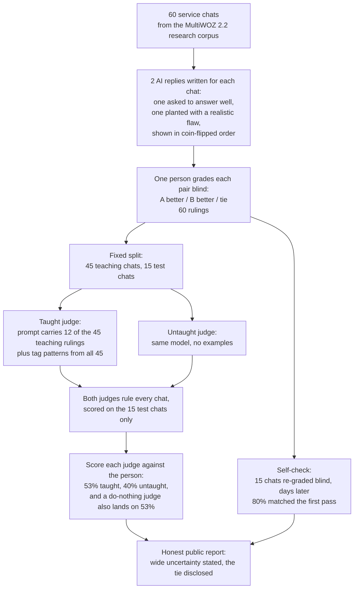
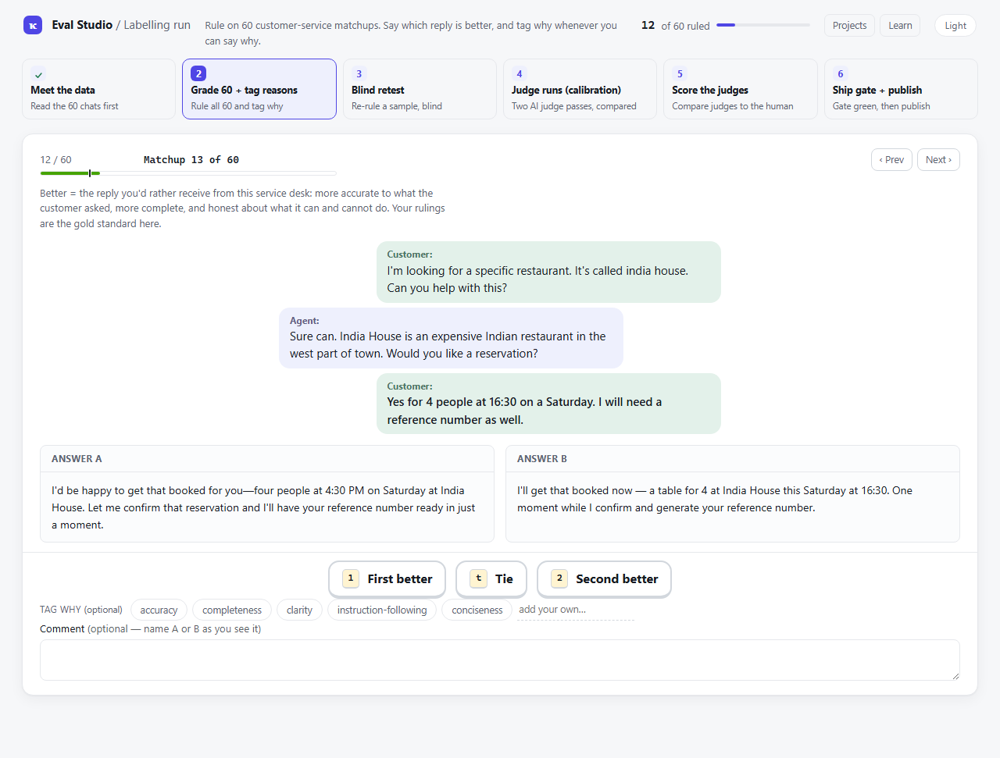
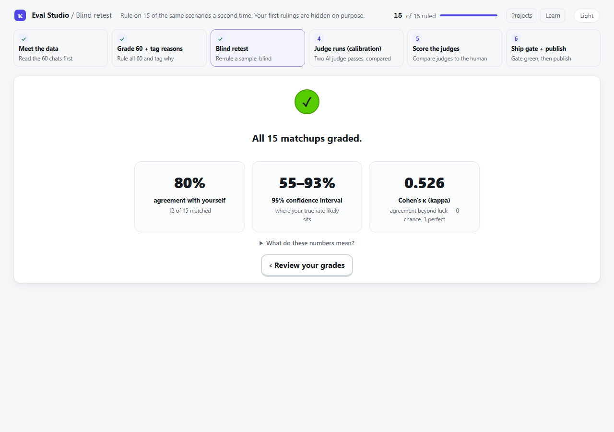
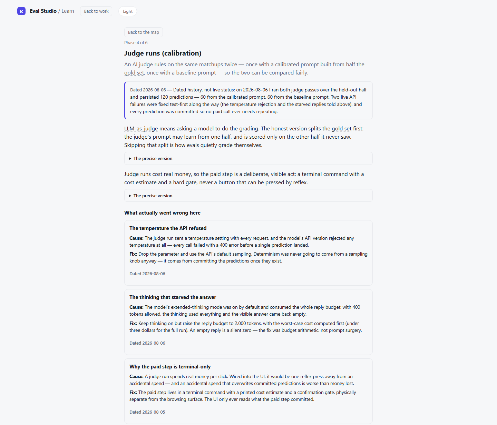
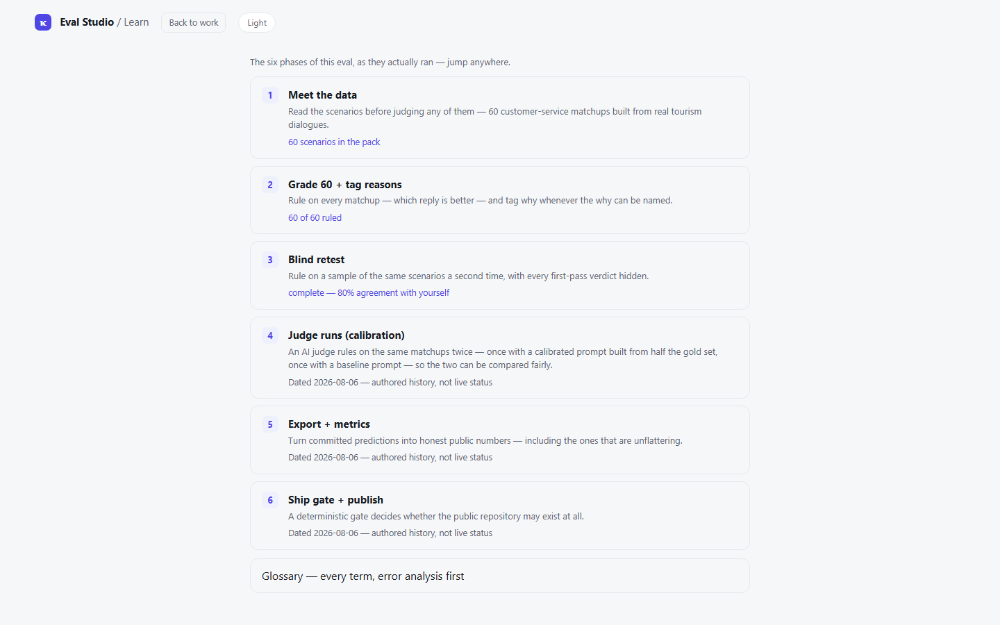

# business-scenario-judge

## Can you trust an AI to grade another AI? This repo checks.

[](https://github.com/Mike-E-Log/business-scenario-judge/actions/workflows/tests.yml)
[](https://github.com/Mike-E-Log/business-scenario-judge/actions/workflows/leak-scan.yml)
[](LICENSE)
[](#check-the-numbers-yourself)

<p align="center">
  <sub>Built by <a href="https://github.com/Mike-E-Log"><b>Mike Ilog</b></a> · AI Engineer · LLM &amp; agent evaluation &nbsp;·&nbsp; <a href="https://www.linkedin.com/in/mikeilog/">LinkedIn</a></sub>
</p>

- **The idea:** an AI judge is only a trustworthy stand-in for a human after you measure how well it matches that human.
- **This repo is that measurement, done honestly.** Every human ruling and every judge answer is saved here. Two commands re-run all the math on your machine. Automated checks fail if the key numbers or honesty statements in this file drift from the saved data.
- **The unflattering result ships anyway:** on the 15 test chats, a do-nothing judge that gives the same answer every time matches the human as often as the taught judge. Both land on 53%.

## Contents

- [The whole eval, on one page](#the-whole-eval-on-one-page)
- [The problem](#the-problem)
- [What happened here](#what-happened-here)
- [The honest result](#the-honest-result)
- [Check the numbers yourself](#check-the-numbers-yourself)
- [What this is, exactly](#what-this-is-exactly)
- [Built with Eval Studio](#built-with-eval-studio)
- [The self-check: grading twice](#the-self-check-grading-twice)
- [Limitations](#limitations)
- [Layout](#layout)

## The whole eval, on one page



## The problem

- **Hand-checking is costly.** One published estimate: about $8 for each AI answer an expert grades ([Eugene Yan's survey of LLM evaluators](https://eugeneyan.com/writing/llm-evaluators/), citing the Shepherd paper).
- **So companies ask a second AI to do the grading.** That opens a new question: is the AI grader any good?
- **The standard first step is to measure the grader against a human, and that measurement is this whole repo.** [OpenAI's guidance](https://developers.openai.com/api/docs/guides/evaluation-best-practices) says to "validate agreement against your human labels before optimizing for cost or latency". The MT-Bench study ([Zheng et al. 2023](https://arxiv.org/abs/2306.05685)) found strong AI judges reach over 80% agreement with human preferences, the level humans reach with each other. No cost saving is claimed here.

## What happened here

1. One person read each chat and picked between two AI answers, 60 times: A better, B better, or tie (a "pairwise" comparison).
2. An AI judge was taught (the "calibrated" judge) from the 45 teaching rulings: its prompt carries 12 of them as worked examples, plus the person's reason-tag patterns counted across all 45.
3. Both the taught judge and an untaught judge then ruled the other 15 chats, which were held out of the teaching step. Which chat belongs to which group is recorded in `data/gold_set.jsonl`, so anyone can check the split.
4. The plan was written before the judges ran: [PREREGISTRATION.md](PREREGISTRATION.md). Preregistration is the research habit of committing to a plan before seeing the results, so the goalposts cannot move afterward. That file carries a dated correction note where its own timing wording claimed more than the git record can prove.

## The honest result

- **The score: 53% against 40%.** The taught judge agreed with the person on 8 of the 15 test chats (53%). The untaught judge agreed on 6 of 15 (40%).
- **Why that is not a win yet:** 15 chats is a small test, so luck alone can move these numbers a lot. Statistically, the taught judge's true skill could sit anywhere from about 27% to 80%, and the untaught judge's anywhere from about 13% to 67% (`metrics/results.json`). The two ranges overlap heavily, so this one run cannot show the teaching truly helped.
- **A harsher comparison:** a do-nothing judge that ignores the chat and always answers "A better" (the person's most common ruling in the teaching half) also lands on 53%, so the taught judge only ties it (recorded as `majority_label_baseline` in `metrics/results.json`).
- **Shown, not hidden:** the tie sits in this file's opening lines, and an automated check compares this text against the data files, so the admission cannot quietly drift or disappear.

## Check the numbers yourself

A few minutes, no AI account needed:

```
pip install -r requirements.txt
python scoring/score.py --gold data/gold_set.jsonl --pred data/predictions.jsonl --out metrics/results.json
python scoring/retest_stats.py --retest data/retest.jsonl --items data/retest_items.json --out metrics/retest.json
```

Every judge answer is already saved in `data/predictions.jsonl`, so the commands just redo the arithmetic. No AI is called.

## What this is, exactly

A demonstration built for this measurement, not a system that ever served real customers.

- **The chats are real public research data:** MultiWOZ 2.2 (MIT licence, Copyright (c) 2019 Paweł Budzianowski), a "Wizard-of-Oz" corpus: people role-playing customer and service agent for research, not logs from a live business (sources and citations: [THIRD_PARTY.md](THIRD_PARTY.md)). Each chat is the opening back-and-forth of one of those conversations, cut off right where the customer asks for something.
- **The pairwise comparison in action:** under each cut-off chat sit two candidate replies, side by side. The grader, human or AI, reads the chat and picks which reply serves the customer better: A better, B better, or tie.
- **Both candidate replies are AI-written, and the judges are AI too:**
  - Reply one: written by `claude-sonnet-5`, asked to answer well.
  - Reply two: written by `claude-haiku-4-5-20251001`, asked to answer plausibly while slipping in one realistic service flaw.
  - Which reply appears first is a coin flip fixed in advance, so position carries no information.
  - Both judges, taught and untaught, run on `claude-sonnet-5`: the same model that wrote reply one. Why that matters is in [Limitations](#limitations).

## Built with Eval Studio

The rulings were made in **Eval Studio**, a local grading app I built for this project. Its code is not part of this repo; it appears here in screenshots.

- **Blind side-by-side (pairwise) grading:** the two replies appear with model names hidden, and the grader picks **A better, B better, or tie**, plus reason tags.
- **A blind re-grading pass** measures the grader's own consistency (the self-check below), with every first-pass verdict hidden.
- **A teaching layer** explains each phase of the eval in place.


*The grading screen, captured mid-run on a fresh instance. Model names are hidden so a pick cannot lean on them.*


*The real self-check result: 80% match (12 of 15), with the same one-person ceiling this README states in words.*


*Each phase page records what ran and what broke: dated, cause then fix, including the two live API failures fixed test-first during the judge runs.*


*The six phases as they really ran. A number appears only once its phase has genuinely produced it.*

## The self-check: grading twice

One person is the entire gold standard here, so the repo measures that person too.

- **The self-check: 80% over 15 scenarios ruled twice** (12 of 15 matched). The same 15 chats were re-ruled 2–4 days later (a range because individual rulings carry no timestamps), with every first-pass verdict hidden.

| Statistic | Value | Plain meaning |
|---|---|---|
| Raw match | 80% | 12 of the 15 second rulings matched the first |
| 95% Wilson range | 55%–93% | with only 15 chats, the true consistency could plausibly sit anywhere from 55% to 93%; 80% is the middle of a wide range, not a precise number |
| Chance-corrected agreement (Cohen's κ) | 0.526 | how much better the match is than lucky guessing: 0 means pure luck, 1 means perfect; 15 chats is too few to attach a firm strength label |

- **The memory question.** After re-ruling each chat, the app asked: do you remember your first ruling? One answer per chat is stored in `data/retest.jsonl`. Every answer was no.
  - Keeping only the chats answered no or unsure changes nothing (the restriction is not selective here: every answer was no).
  - Being asked about memory can itself nudge later rulings; that side effect is disclosed rather than designed away.
  - Saying no cannot prove memory played no part, so 80% stays an upper bound on this one person's consistency.
- **The sample was locked in advance.** The 15 re-ruled chats came from a fixed random draw saved in `data/retest_items.json` before the re-grading began, so they could not be hand-picked afterward. A match means the exact same verdict: A better, B better, or tie.

## Limitations

- **Every ruling comes from one person.** That one judgment is the gold standard, so every number inherits their consistency and their blind spots.
- **Small numbers everywhere.** 60 chats total, 15 in the test set, 15 in the self-check. Read the 95% ranges in `metrics/results.md` before treating any gap as real.
- **Known biases are not controlled.** An AI judging AI text can favor text that resembles its own. Both judges here run on `claude-sonnet-5`, the same model that wrote reply one, so that risk applies directly and is not corrected for.
- **Order effects are handled, not erased.** Judges can favor whichever reply appears first. Reply order is randomised, which handles position but not the self-preference above.
- **Memory in the self-check.** The 80% self-agreement is a ceiling, not a precise measure (see the memory question above).
- **One run.** One dataset, one model family, no repeats.

## Layout

- `data/gold_set.jsonl`: the 60 chats, the person's ruling, the teach/test split, and reason tags
- `data/predictions.jsonl`: every ruling from both judges
- `data/retest_items.json`: the fixed draw of 15 chats ruled twice
- `data/retest.jsonl`: both rulings and the memory answer for each re-ruled chat
- `judge/baseline_prompt.txt`, `judge/calibrated_prompt.txt`: the exact prompts (the calibrated prompt embeds the person's verbatim written notes for its 12 example rulings)
- `metrics/results.json`, `metrics/results.md`: the recomputed numbers
- `metrics/retest.json`: the self-check's committed recompute output
- `scoring/score.py`, `scoring/retest_stats.py`: the recompute-only scripts
- `PREREGISTRATION.md`: the pre-run plan, with its dated correction note
- `THIRD_PARTY.md`: source-data licences and citations
